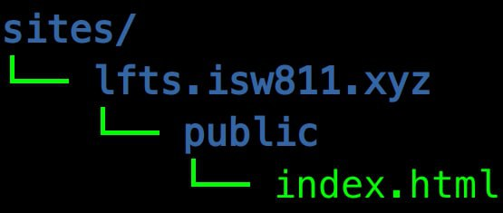

# Workshop02 - Anibal Castro Ponce - ISW811
---
---
### <Strong>Instalar LAMP y publicar un sitio.</Strong>
---
---
## Creación de la maquina debian con Vagrant:
1) Crear una carpeta VMs con el comando:  ```$ mkdir VMs ```
2) Crear otra carpeta en donde se instalara la maquina debian/bullseye64 ```$ mkdir WebServer```
3) Ingresamos a la carpeta con el comando ```$ cd WebServer```.
4) Estando en la carpeta WebServer ejecutamos el comando ``` $ vagrant init debian/bullseye64 ```
5) En dado caso que tengan instalado Visual estudio ejecutan ``` $ code Vagrantfile ``` sino utilizan ``` $ notepad Vagrantfile ``` y descomentan la linea numero 35 y se guarda el archivo.
6) Una vez hecho el paso anterior podemos iniciar la maquina con el comando ```$ vagrant up```
7) Para iniciar sesión en la maquina virtual se ejecuta el comando ``` $ vagrant ssh ```.

## Instalación de LAMP
1) Una vez dentro de la maquina virtual bullseye64 tenemos que actualizar la lista de paquetes disponibles. ``` $ sudo apt-get update ```
2) Instalaremos Vim, Curl, Apache2, MySQL y PHP, el comando es el siguiente: ``` $ sudo apt-get install vim vim-nox curl git apache2 mariadb-server mariadb-client php7.4 php7.4-bcmath php7.4-curl php7.4-json php7.4-mbstring php7.4-mysql php7.4-xml ```
3) Descargaremos en la carpeta que en mi caso se llama WebServer, es donde se almacena la maquina virtual, descargar el siguiente archivo, para abrirlo ingresar al [LINK](https://drive.google.com/file/d/1Hw8WpoykhUIXzmgkli2vuBCymA9ZzJnB/view?usp=sharing).
4) Copiaremos el archivo en la carpeta sites-available: ``` sudo cp /vagrant/lfts.isw811.xyz.conf /etc/apache2/sites-available/```
5) Habilitamos 3 módulos de Apache: ``` sudo a2enmod vhost_alias rewrite ssl```
6) Crearemos una estructura de carpetas parecido a la siguiente imagen el comando es: ```mkdir -p ~/sites/lfts.isw811.xyz/public```:

7) Agregamos lo que deseamos que salga en nuestro sitio web en mi caso agregare un <strong>Hola mundo!</strong>
el comando es el siguiente: ``` echo "Hola mundo!" > ~/sites/lfts.isw811.xyz/public/index.html ```
8) Agregaremos un parametro (ServerName) a la configuracion de Apache: ``` echo "ServerName webserver" | sudo tee -a /etc/apache2/apache2.conf ```
9) Se hace una comprobacion para ver si no hay errores de sintaxis: ``` sudo apache2ctl -t```
10) Ya nos quedaria nada mas habilitar el sitio con el siguiente comando: ``` sudo a2ensite lfts.isw811.xyz.conf```
11) Ultimo paso seria recargar la configuracion de apache: con el comando sugerido ```sudo systemctl reload apache2```

----------------------
---------------------
### Notas importantes:
<Strong>Consola:</Strong>

* ``` pwd``` -> Es para saber mi ubicación en la consola.
* ``` ls ``` -> Muestra archivos.
* ``` tree -a``` -> Muestra archivos ocultos.
* ``` cat ``` -> Se puede mostrar el contenido de un archivo.
----------
<Strong>Vagrant:</Strong>
* ``` Vagrant up ``` -> Encender la maquina.
* ``` Vagrant ssh ``` -> Ingresar a la maquina virtual.
* ``` Vagrant halt ``` -> Apagar la maquina.
* ``` Vagrant destroy ``` -> Destruir la maquina.
* ```ssh-keygen -t rsa ``` -> Comando para crear una llave.
* Se recomienda usar git bash o PowerShellx64.
----------
-----

